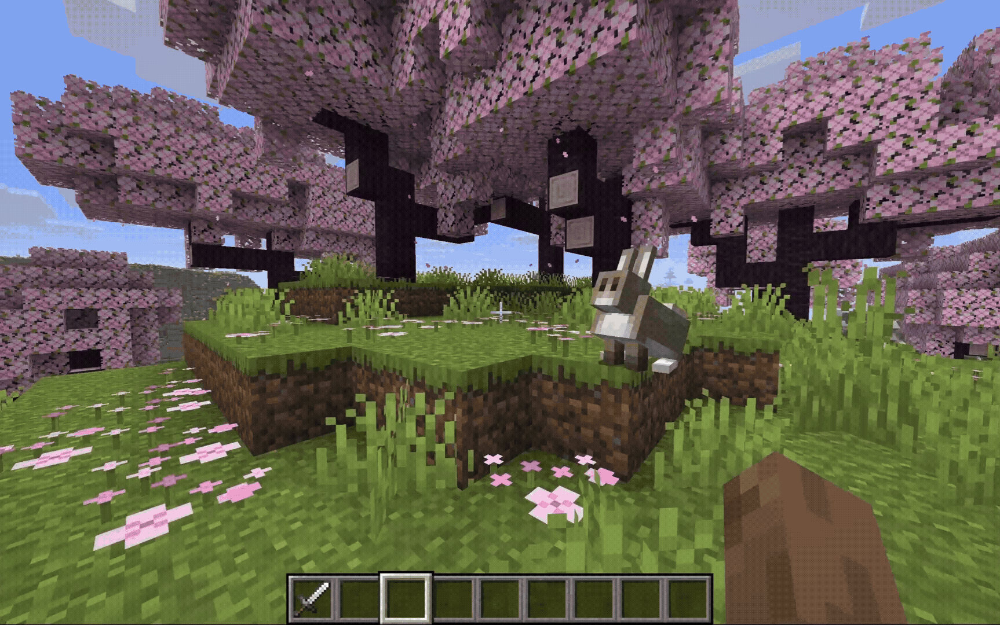

#  Minecraft Japanese Vocabulary Helper (MinnaNoCraft)

> **Status do Projeto:** Em Desenvolvimento! | Projeto de TCC

Este é um mod para **Minecraft Java Edition** desenvolvido como Trabalho de Conclusão de Curso (TCC) para a graduação em **Engenharia da Computação**.

O objetivo do mod é atuar como uma ferramenta de aprendizado imersivo e gamificado, auxiliando na aquisição de vocabulário da língua japonesa de forma progressiva e dinâmica diretamente durante o gameplay.

---

##  Como Funciona (Lógica de Aprendizado)

Diferente de uma tradução estática, o mod altera os nomes dos itens dinamicamente conforme o jogador interage com eles (passando o mouse no inventário ou segurando o item na hotbar).

O grande diferencial técnico é que **o progresso é contabilizado por palavra isolada, não por item**. Se o jogador aprender que "Ferro" é *“Tetsu”*, a palavra mudará em todos os itens que contêm ferro (ex: Espada de Ferro, Picareta de Ferro).

###  Depuração Técnica e Mecânica de Foco (F3 + H)

O mod integra-se ao sistema nativo de informações avançadas do Minecraft (**F3 + H**). Ao ativar esse modo, o jogador/avaliador pode visualizar os metadados em tempo real na tooltip do item:
* **Tokens:** A divisão do nome do item nas palavras que o compõem.
* **XP por Palavra:** O progresso atual de aprendizado de cada token.
* **Mecânica de Foco Antissobrecarga:** O sistema identifica qual palavra está ganhando XP no momento, garantindo que o jogador evolua **apenas uma palavra por vez** para evitar fadiga cognitiva.

>  **Nota de Renderização:** O cálculo de ganho de XP ocorre em tempo de execução durante o hover. Caso uma palavra suba de nível, a nova grafia (ex: Rōmaji para Hiragana) será atualizada visualmente no próximo hover do item.

###  Os 4 Níveis de Dificuldade Dinâmica:
1. **Nível 1 (Padrão):** Português (ex: `Espada de Ferro`)
2. **Nível 2 (Rōmaji):** Leitura japonesa com caracteres latinos (ex: `Espada de Tetsu`)
3. **Nível 3 (Rōmaji):** Leitura japonesa com caracteres latinos, mas agora com estrutura em japones(ex: `Tetsu no Ken`)
4. **Nível 4 (Hiragana):** Substituição pelo silabário japoneses.
5. **Nível 5 (Kanji/katakana):** Nível avançado com os ideogramas (ou Katakana para termos estrangeiros).

---

##  Stack Tecnológica & Requisitos

- **Ambiente de Desenvolvimento:** Minecraft Java Edition
- **Versão do Jogo:** 26.1.2
- **Linguagem Principal:** Java
- **Mod Loader:** Fabric

---

##  Status das Funcionalidades (Roadmap)

### Atualmente Implementado
- [x] Sistema de tradução dinâmica e progressiva de itens (90% dos items tem traduções).
- [x] Lógica de rastreamento de progresso baseado em palavras (Tokens).
- [x] Suporte a 5 níveis de transição (PT-BR ➔ Rōmaji ➔ Rōmaji formatado em japonês ➔ Hiragana ➔ Kanji).
- [x] **Dicionário Interno (GUI):** Interface no jogo para consultar traduções e revisar palavras aprendidas (consultar o dicionário penalizará o progresso da palavra).
- [x] **HUD de Alvos Flutuante:** Janela flutuante na tela mostrando o nome traduzido dos blocos/entidades que o jogador está olhando no mapa.

### Em Desenvolvimento / Próximos Passos
- [ ] **Tela de Configurações:** Aba nativa no menu de opções do Minecraft para gerenciar o mod.
- [ ] **Internacionalização (i18n):** Adaptar o sistema base para suportar Inglês ➔ Japonês (atualmente focado em PT-BR ➔ Japonês).

---

##  Motivação e Engenharia

Este projeto nasceu da união de interesse pessoal, com a oportunidade de aplicar conceitos de Engenharia da Computação, como:
- **Estruturas de Dados Eficientes:** Para busca e substituição de strings em tempo de renderização do jogo sem causar quedas de FPS (frames por segundo).
- **Persistência de Dados:** Salvamento do progresso do usuário de forma leve e assíncrona.
- **Design de Interface (UI/UX):** Criação de componentes visuais integrados à HUD nativa do Minecraft.

---

##  Autor

Desenvolvido por **WesleyhDias** como projeto de TCC em Engenharia da Computação.

- **LinkedIn:** [[Wesley Henrique](https://www.linkedin.com/in/wesleyhdias/)]
- **E-mail:** wesleyhdmelo@gmail.com

## License

This template is available under the CC0 license. Feel free to learn from it and incorporate it in your own projects.
